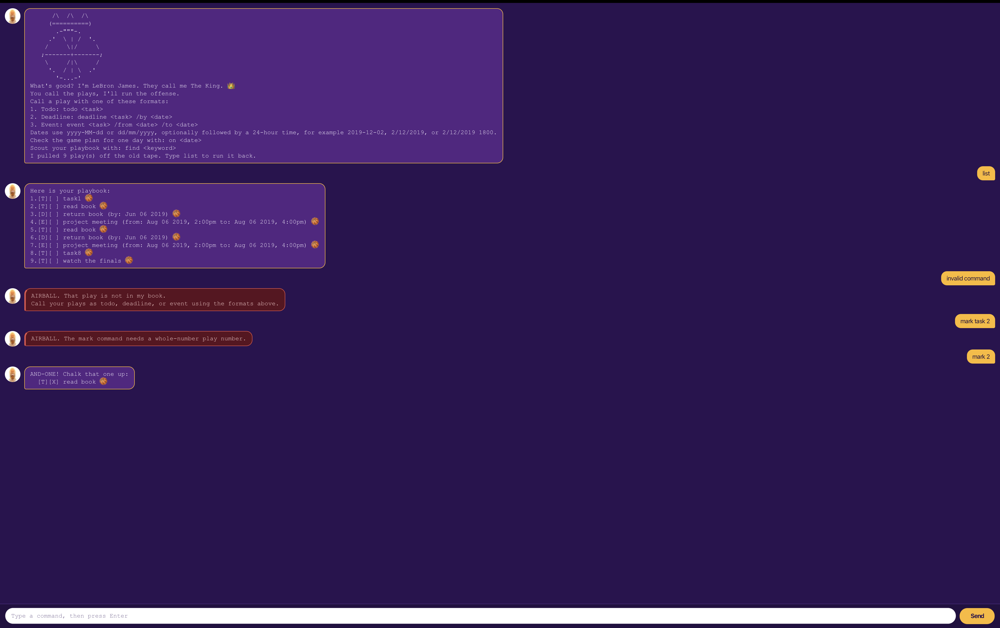

# LeBron James 👑

**LeBron James** — "The King" — is a desktop chatbot that keeps track of the
things you have to do. He talks basketball: your tasks are **plays**, and your
task list is the **playbook**.

You work with him by typing, so if you can type quickly you can get your list
sorted faster than with a mouse-driven app.



## Quick start

1. Make sure you have **Java 25** installed.
2. Download `lebronjames.jar` and drop it in an empty folder.
3. Open a command window in that folder and run `java -jar "lebronjames.jar"`.
4. Type a command into the box at the bottom and press **Enter**. Try `list`.

Your playbook is saved to `data/lebronjames.txt`, next to the JAR. There is no
save command — every change is written out immediately, and reloaded the next
time you start up.

## Finding your way around the window

| What you see | What it is |
| --- | --- |
| A **gold** bubble on the right | Something you typed |
| A **purple** bubble on the left | The King's reply |
| A **red** bubble on the left | He did not understand you — nothing was changed |

Drag the window to whatever size suits you; the conversation reflows to fit.

## Adding plays

A play is one of three kinds, depending on whether it has a date attached.

### A todo — no date

Format: `todo <description>`

```
todo read book
```

```
BUCKET! That play is on the board:
  [T][ ] read book 🏀
That makes 1 plays in the playbook.
```

### A deadline — due by a date

Format: `deadline <description> /by <date>`

```
deadline return book /by 2019-06-06
```

```
BUCKET! That play is on the board:
  [D][ ] return book (by: Jun 06 2019) 🏀
That makes 2 plays in the playbook.
```

### An event — runs from one date to another

Format: `event <description> /from <start> /to <end>`

```
event project meeting /from 2019-08-06 1400 /to 2019-08-06 1600
```

```
BUCKET! That play is on the board:
  [E][ ] project meeting (from: Aug 06 2019, 2:00pm to: Aug 06 2019, 4:00pm) 🏀
That makes 3 plays in the playbook.
```

## Writing dates

Anywhere a date is accepted, write it either way round, optionally followed by a
24-hour time:

| You type | It means |
| --- | --- |
| `2019-12-02` | 2 December 2019, no particular time |
| `2/12/2019` | the same day, written the other way round |
| `2019-12-02 1800` | 2 December 2019 at 6:00pm |

A date that does not exist is refused rather than quietly shifted, so
`2019-02-30` is reported as an error instead of becoming 28 February.

## Seeing the whole playbook

Format: `list`

```
Here is your playbook:
1.[T][ ] read book 🏀
2.[D][ ] return book (by: Jun 06 2019) 🏀
3.[E][ ] project meeting (from: Aug 06 2019, 2:00pm to: Aug 06 2019, 4:00pm) 🏀
```

The numbers shown here are the ones to use with `mark`, `unmark` and `delete`.
`[X]` means done; `[ ]` means still to do.

## Ticking a play off

Format: `mark <number>`, and `unmark <number>` to put it back.

```
mark 1
```

```
AND-ONE! Chalk that one up:
  [T][X] read book 🏀
```

## Dropping a play

Format: `delete <number>`

```
delete 1
```

```
Subbed out. That play is off the board:
  [T][ ] read book 🏀
That leaves 2 plays in the playbook.
```

## Checking one day

Shows the deadlines and events falling on a date. Todos never appear here, since
they carry no date, and an event spanning several days shows up on each of them.

Format: `on <date>`

```
on 2019-06-06
```

```
Game plan for Jun 06 2019:
1.[D][ ] return book (by: Jun 06 2019) 🏀
```

## Searching

Finds plays whose description contains the text you give. Capitalisation is
ignored and the match can be anywhere, so `book` also finds `bookshop`.

Format: `find <keyword>`

```
find book
```

```
Here are the plays that match:
1.[T][ ] read book 🏀
2.[D][ ] return book (by: Jun 06 2019) 🏀
```

## Leaving

Format: `bye`

```
Game over. Taking my talents home. 👑🏀
```

The window closes a moment later, once you have had a chance to read that.

## Duplicates are turned down

Add a play you already have and the King refuses it, naming the one it clashes
with, so a second copy cannot pile up unnoticed:

```
TRAVELLING! That play is already on the board, as number 1:
  [T][ ] Read Book
If you really need it twice, give one of them a different description.
```

Two plays count as the same only when they are the same kind, their descriptions
match ignoring capitalisation, and their dates match. So a repeating chore is
still fine — these are two different plays, and both are accepted:

```
deadline submit report /by 2019-12-02
deadline submit report /by 2019-12-09
```

> **Note:** duplicates already sitting in your save file from before this check
> existed are left alone rather than silently deleted. Remove the ones you do
> not want with `delete`.

## Command summary

| Action | Format |
| --- | --- |
| Add a todo | `todo <description>` |
| Add a deadline | `deadline <description> /by <date>` |
| Add an event | `event <description> /from <start> /to <end>` |
| See everything | `list` |
| Tick off / put back | `mark <number>`, `unmark <number>` |
| Drop a play | `delete <number>` |
| Check one day | `on <date>` |
| Search | `find <keyword>` |
| Leave | `bye` |
